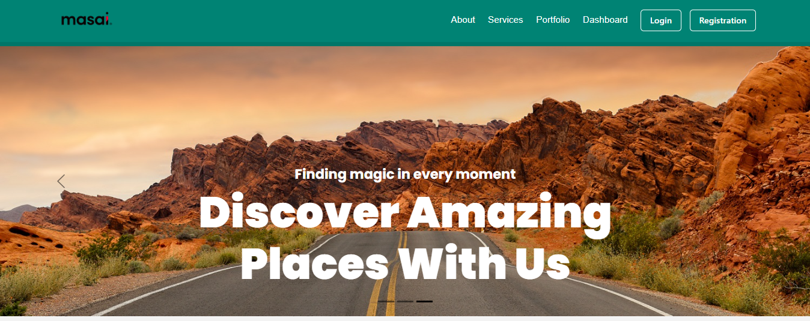
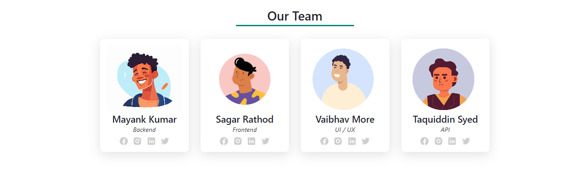
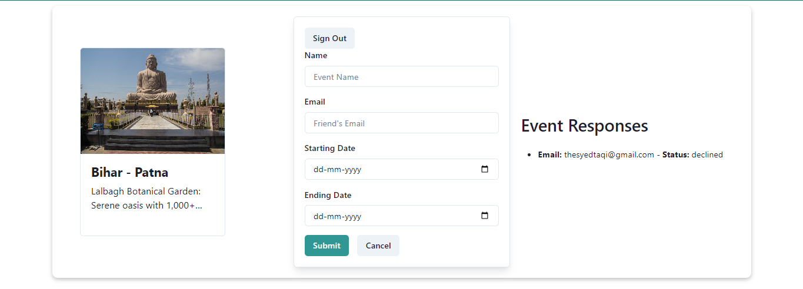
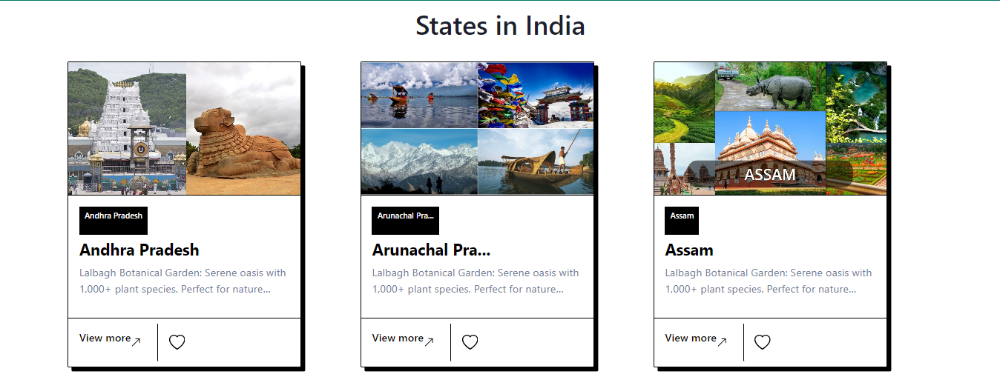

# Weekend Planner

## Introduction
Struggling to plan the perfect weekend getaway with friends? Weekend Planner is a MERN stack web application that takes the hassle out of organizing your next adventure. With Weekend Planner, you can easily:
- Select a location for your weekend trip.
- Invite your friends to join the fun.
- Save your planned event to your dashboard for easy reference.
- Delete events you no longer need.


## Project Type
Fullstack

## Deployed App
Check Here: [https://deployed-site.whatever](https://deployed-site.whatever)

## Directory Structure

my-app/
├─ backend/
├─ frontend/
│ ├─ ...


## Video Walkthrough of the Project
Attach a very short video walkthrough of all of the features [1 - 3 minutes]

## Video Walkthrough of the Codebase
Attach a very short video walkthrough of the codebase [1 - 5 minutes]

## Screenshots










## Features
List out the key features of your application.

- User Management
  - Authentication & Login: Secure user registration and login using React components and authentication libraries.
  - Change Password & Email Verification: Implement functionalities within React components to manage password changes and email verification workflows.
  - Forgot Password Recovery: Build a React form for users to request password resets and receive recovery instructions.

- Location Exploration
  - State & District Selection: Utilize React components like dropdown menus or searchable lists for users to filter locations by state and district.
  - Location Recommendations (details to come later): (Consider using React libraries or APIs to display location suggestions based on user preferences or location data - details in later sections).

- Event Planning (React-driven)
  - Event Creation: Build React forms for users to create events, capturing details like location, dates, and activities.
  - Dashboard Management: Develop a React component for the user dashboard, displaying saved events and allowing easy access.
  - Event Invitation: Integrate functionalities within React components to allow users to invite friends to events through the platform.
  - Event Management: Implement React components for users to edit or delete their created events.

- Planned Integrations (Future)
  - Social Media Connection for easier sharing & invites: (Consider integrating React social media libraries to allow users to connect accounts for easier sharing and sending invites).
  - Calendar Integration for automatic event reminders: (Explore React calendar libraries or APIs for seamless calendar integration and automatic event reminders for invited users).

## Design Decisions or Assumptions
List your design decisions & assumptions.

## Installation & Getting Started
Detailed instructions on how to install, configure, and get the project running. For BE/FS projects, guide the reviewer on how to check MongoDB schema, etc.

```bash
    git clone https://github.com/vaibhav540/Democracy-Data_035.git
    cd my-project
    npm install
    npm run dev
```

## API Endpoints

- Home Page: `/`
  - Description: The landing page of the application.
  - Component: `HomePage`

- Login: `/account/login`
  - Description: User login page.
  - Component: `Login`

- Register: `/account/register`
  - Description: User registration page.
  - Component: `Register`

- Verify Email: `/account/verify-email`
  - Description: Page for users to verify their email address.
  - Component: `VerifyEmail`

- Reset Password Link: `/account/reset-password-link`
  - Description: Page for users to request a password reset link.
  - Component: `ResetPasswordLink`

- Reset Password Confirm: `/account/reset-password-confirm/:id/:token`
  - Description: Page for users to confirm their password reset.
  - Component: `ResetPasswordConfirm`
  - Parameters:
    - `id`: User ID
    - `token`: Password reset token

- Profile: `/user/profile`
  - Description: User profile page.
  - Component: `Profile`

- Change Password: `/user/change-password`
  - Description: Page for users to change their password.
  - Component: `ChangePassword`

- User Profile Settings: `/user/settings`
  - Description: Page for users to manage their profile settings.
  - Component: `UserProfileSetting`

- About: `/user/about`
  - Description: About page for users.
  - Component: `About`

- District Section: `/user/state/district/:stateName`
  - Description: Page for users to view districts within a selected state.
  - Component: `DistrictSection`
  - Parameters:
    - `stateName`: Name of the state


## Technology Stack


This project utilizes a variety of modern technologies to deliver a seamless and efficient user experience. Below is a brief overview of the key technologies used:

- React: A popular JavaScript library for building user interfaces, particularly for single-page applications. React allows for the creation of reusable UI components.

- Redux: A predictable state container for JavaScript apps, often used with React to manage the application state in a more manageable and scalable way.

- Chakra UI: A simple, modular, and accessible component library that gives you all the building blocks you need to build your React applications.

- Bootstrap: A powerful, mobile-first front-end framework for faster and easier web development. It includes CSS- and JavaScript-based design templates for typography, forms, buttons, navigation, and other interface components.

- Tailwind CSS: A utility-first CSS framework for rapidly building custom user interfaces. It provides low-level utility classes that enable you to build complex designs without leaving your HTML.

- Google APIs: A set of APIs provided by Google to interact with their services. This project uses Google APIs for functionalities like calendar integration and location data.

- MongoDB: A NoSQL database program that uses JSON-like documents with optional schemas. MongoDB is used to store and manage the applications data.

- Emotion: A library designed for writing CSS styles with JavaScript. It provides powerful and flexible tools for managing CSS in React applications.

- FontAwesome: A popular icon set and toolkit used in web applications to include scalable vector icons that can be customized with CSS.

- Axios: A promise-based HTTP client for the browser and Node.js. It is used to make HTTP requests to interact with backend services.

- React Hook Form: A library for managing form state in React applications. It simplifies the process of handling form validation, submission, and error handling.

- React Router: A collection of navigational components that compose declaratively with your application. It is used for handling client-side routing in React applications.

- CSS: Cascading Style Sheets used to style the HTML elements in the application.

- Babel: A JavaScript compiler that allows you to use the latest JavaScript features in your codebase. Babel compiles your JavaScript code to be compatible with older browsers.

## I.A
- Aditya - (onlyaditya)

## Contributors

We are grateful to the following contributors who have dedicated their time and effort to help develop this project:

- Vaibhav More - [@vaibhav540](https://github.com/vaibhav540)
- Mayank Kumar - [@Mayank1st](https://github.com/Mayank1st)
- Sagar Rathod - [@sagarrathod7568](https://github.com/sagarrathod7568)
- Taqiuddin Syed - [@mr-taqi](https://github.com/mr-taqi)


